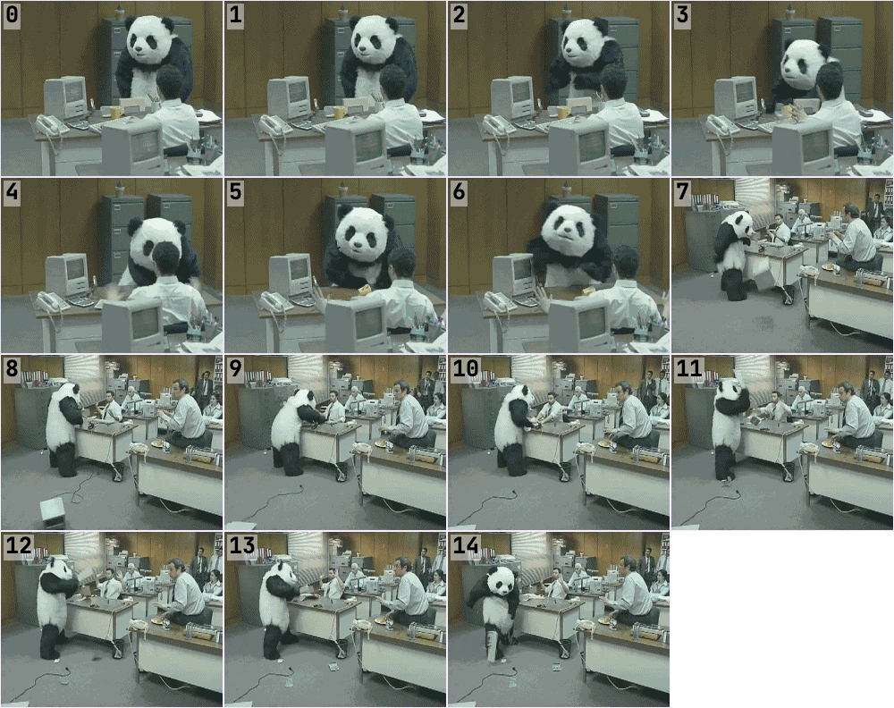
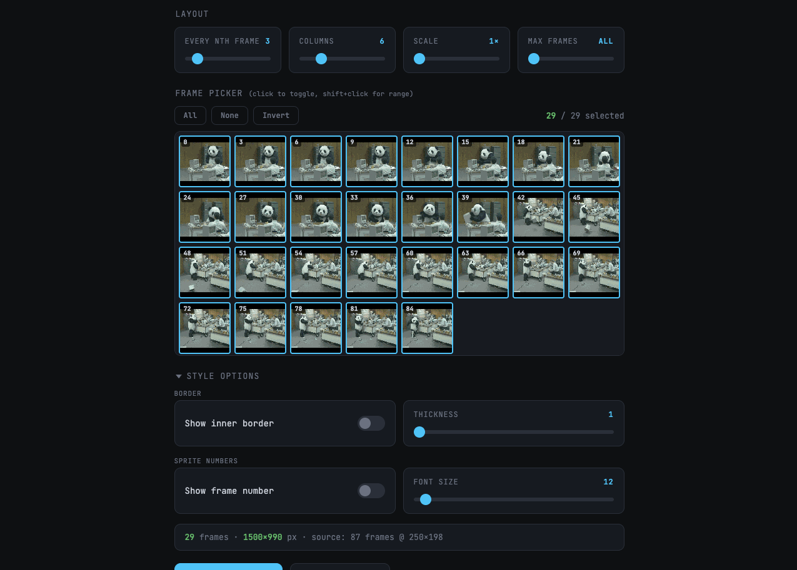

# GIF to Spritesheet

**Convert GIFs into single-image spritesheets — built for sharing AI agent demos with Claude Code, Cursor, and beyond.**

**[Try it now](https://harveylijh.github.io/gif-2-spritesheet/)**

---

## Demo

**Input:** An animated GIF recording

**Output:** A single spritesheet PNG with numbered frames

**Interface:**

---

## Why?

Screen recordings of AI coding agents (Claude Code, Cursor, Windsurf, etc.) often produce GIFs or videos with hundreds of frames. Sharing these in conversations, docs, or issues hits size limits fast — and animated GIFs can't be annotated or scanned at a glance.

**A spritesheet solves this.** One static PNG. Every frame visible. Numbered, bordered, and sized exactly how you need it.

## Features

| Feature | Details |
|---|---|
| **Frame sampling** | Keep every Nth frame to reduce noise from long recordings |
| **Frame picker** | Click to include/exclude individual frames; shift-click for range selection |
| **Customizable columns** | Control grid layout (2-20 columns) |
| **Scale** | 1x to 4x scaling for readability |
| **Frame numbers** | Sequential or source-index numbering, any corner, auto-contrast colors |
| **Borders** | Adjustable thickness and color (auto, black, white, grey, red, green) |
| **Max frames cap** | Limit output to a set number of frames |
| **Live preview** | Zoomable preview with fit-to-window |
| **One-click export** | Download as PNG or copy stats to clipboard |

## How to Use

1. Open the [tool](https://harveylijh.github.io/gif-2-spritesheet/)
2. Drag & drop a `.gif` (or click to browse)
3. Adjust sampling, columns, borders, and numbering
4. Pick or exclude specific frames
5. Download the spritesheet as a single PNG

## Use Cases

- **Sharing Claude Code sessions** — turn a terminal recording into a scannable image for PRs, docs, or bug reports
- **AI agent demo reels** — compress long automation GIFs into a single annotated image
- **Bug reproduction** — show exact frames where an issue occurs with numbered references
- **Documentation** — embed step-by-step visuals without requiring GIF playback support
- **Code review** — attach before/after spritesheets to pull requests

## Technical Notes

- Runs entirely in your browser — no uploads, no server, no dependencies
- Uses the [ImageDecoder API](https://developer.mozilla.org/en-US/docs/Web/API/ImageDecoder) (Chrome/Edge required)
- Zero install — just open the page

## Contributing

Feature requests are welcome — [open an issue](https://github.com/HarveyLijh/gif-2-spritesheet/issues). Feel free to fork and build on it however you like.

## License

MIT
